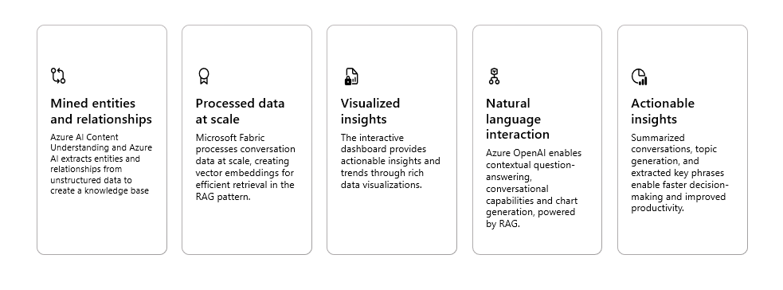
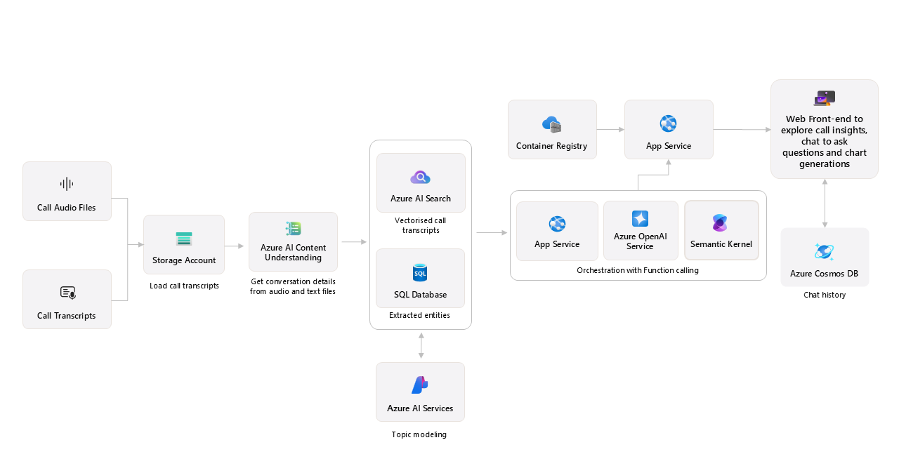

# Conversation knowledge mining solution accelerator

MENU: [**USER STORY**](#user-story) \| [**QUICK DEPLOY**](#quick-deploy)  \| [**SUPPORTING DOCUMENTATION**](#supporting-documentation) 

<h2>
<br/>
User story
</h2>

### Overview

This solution accelerator enables customers with large amounts of conversational data to improve decision-making by leveraging intelligence to uncover insights, relationships, and patterns from customer interactions. It empowers users to gain valuable knowledge and drive targeted business impact. 

It leverages Azure AI Foundry, AI Content Understanding, Azure OpenAI, and Azure AI Search to transform large volumes of conversational data into actionable insights through topic modeling, key phrase extraction, speech-to-text transcription, and interactive chat experiences.


### Technical key features



Below is an image of the solution accelerator.


### Use case / scenario

An analyst managing large volumes of conversational data needs a solution to visualize key insights and uncover patterns using natural language. An interactive dashboard enables them to explore rich, actionable insights for faster, and more informed decision-making.
 
This solution empowers analysts with tools to ask questions and receive real-time, contextualized responses. It streamlines problem-solving, enhances collaboration, and fosters innovation by making data-driven insights accessible and shareable.

The sample data used in this repository is synthetic and generated using Azure Open AI service. The data is intended for use as sample data only.

### Solution architecture



<h2>
<br/>
QUICK DEPLOY
</h2>

| [](https://codespaces.new/microsoft/Conversation-Knowledge-Mining-Solution-Accelerator) | **┃** | [](https://vscode.dev/redirect?url=vscode://ms-vscode-remote.remote-containers/cloneInVolume?url=https://github.com/microsoft/Conversation-Knowledge-Mining-Solution-Accelerator) | **┃** | [](https://portal.azure.com/#create/Microsoft.Template/uri/https%3A%2F%2Fraw.githubusercontent.com%2Fmicrosoft/Conversation-Knowledge-Mining-Solution-Accelerator%2Fmain%2Finfra%2Fmain.json) |
|---|---|---|---|---|
        


### **Prerequisites**

To deploy this solution accelerator, ensure you have access to an [Azure subscription](https://azure.microsoft.com/free/) with the necessary permissions to create **resource groups and resources**.  

Check the [Azure Products by Region](https://azure.microsoft.com/en-us/explore/global-infrastructure/products-by-region/?products=all&regions=all) page and select a **region** where the following services are available:  

- **Azure AI Foundry**  
- **Azure OpenAI Services**  
- **Azure AI Search**
- **Azure Semantic Search**
- **Azure AI Content Understanding**  
- **Embedding Deployment Capacity**  
- **GPT Model Capacity**  

#### **Recommended Deployment Regions**  

> ✅ **eastus** (East US)  
> ✅ **eastus2** (East US 2)  


#### Select a region where Semantic Search Availability is available before proceeding with the deployment.

Steps to Check Semantic Search Availability
1. Open the [Semantic Search Availability](https://learn.microsoft.com/en-us/azure/search/search-region-support) page.
2. Scroll down to the **"Availability by Region"** section.
3. Use the table to find supported regions for **Azure AI Search** and its **Semantic Search** feature.
4. If your target region is not listed, choose a supported region for deployment.

#### **Configurable Deployment Settings**  

When you start the deployment, most parameters will have **default values**, but you can update the following:  

| **Setting** | **Description** |  
|------------|----------------|  
| **Azure Region** | The region where resources will be created. |  
| **Environment Name** | A **3-20 character alphanumeric value** used to prefix resources. |  
| **Content Understanding Location** | Select from a **drop-down list** of values. |  
| **Secondary Location** | A **less busy** region for **Azure SQL and CosmosDB**, useful in case of availability constraints. |  
| **Deployment Type** | Select from a **drop-down list**. |  
| **GPT Model** | Choose from **GPT-4, GPT-4o, GPT-4o Mini**. <br> **Default models:** GPT-4o Mini |  
| **GPT Model Deployment Capacity** | Configure capacity for **GPT models**. |  
| **Embedding Model** | Default: **text-embedding-ada-002**. |  
| **Embedding Model Capacity** | Set the capacity for **embedding models**. |  

---

### **[Optional] Quota Recommendations**  

By default, the **GPT model capacity** in deployment is set to **30k tokens**.  

#### **Recommended Quota for Optimal Performance**  

| **Model Type**        | **Default Capacity** | **Recommended Capacity** |  
|----------------------|--------------------|--------------------|  
| **GPT Model**       | 30k tokens         | 100k tokens       |  


To adjust quota settings, follow these steps:  

#### **How to Check & Update Quota**  

1. **Navigate** to the [Azure AI Foundry portal](https://portal.azure.com/).  
2. **Select** the AI Project associated with this accelerator.  
3. **Go to** the `Management Center` from the bottom-left navigation menu.  
4. Select `Quota`  
   - Click on the `GlobalStandard` dropdown.  
   - Select the required **GPT model** (`GPT-4, GPT-4o, GPT-4o Mini`) or **Embeddings model** (`text-embedding-ada-002`).  
   - Choose the **region** where the deployment is hosted.  
5. Request More Quota or delete any unused model deployments as needed.  
<br>

**⚠️ Warning:**  **Insufficient quota can cause deployment issues.** Ensure you have the recommended capacity.

---

### **Options**
Pick from the options below to see step-by-step instructions for: GitHub Codespaces, VS Code Dev Containers, Local Environments, and Bicep deployments.

<details>
  <summary><b>Deploy in GitHub Codespaces</b></summary>

### GitHub Codpespaces

You can run this solution accelerator virtually by using GitHub Codespaces. The button will open a web-based VS Code instance in your browser:

1. Open the solution accelerator (this may take several minutes):

    [](https://codespaces.new/microsoft/Conversation-Knowledge-Mining-Solution-Accelerator)
2. Accept the default values on the create Codespaces page
3. Open a terminal window if it is not already open
4. Continue with the [deploying steps](#deploying)

</details>

<details>
  <summary><b>Deploy in VS Code</b></summary>

 ### VS Code Dev Containers

A related option is VS Code Dev Containers, which will open the project in your local VS Code using the [Dev Containers extension](https://marketplace.visualstudio.com/items?itemName=ms-vscode-remote.remote-containers):

1. Start Docker Desktop (install it if not already installed)
2. Open the project:

    [](https://vscode.dev/redirect?url=vscode://ms-vscode-remote.remote-containers/cloneInVolume?url=https://github.com/microsoft/Conversation-Knowledge-Mining-Solution-Accelerator)


3. In the VS Code window that opens, once the project files show up (this may take several minutes), open a terminal window.
4. Continue with the [deploying steps](#deploying)

</details>

<details>
  <summary><b>Deploy in your local environment</b></summary>

 ### Local environment

If you're not using one of the above options for opening the project, then you'll need to:

1. Make sure the following tools are installed:

    * [Azure Developer CLI (azd)](https://aka.ms/install-azd)
    * [Python 3.9+](https://www.python.org/downloads/)
    * [Docker Desktop](https://www.docker.com/products/docker-desktop/)
    * [Git](https://git-scm.com/downloads)

2. Download the project code:

    ```shell
    azd init -t microsoft/Conversation-Knowledge-Mining-Solution-Accelerator/
    ```

3. Open the project folder in your terminal or editor.

4. Continue with the [deploying steps](#deploying).

</details>

<details>
  <summary><b>Deploy with Bicep/ARM template</b></summary>

### Quick Deploy (Bicep)

1. **Deploy Azure resources**  
   Click the following deployment button to create the required resources for this accelerator directly in your Azure Subscription.

   [](https://portal.azure.com/#create/Microsoft.Template/uri/https%3A%2F%2Fraw.githubusercontent.com%2Fmicrosoft%2FConversation-Knowledge-Mining-Solution-Accelerator%2Fmain%2Finfra%2Fmain.json)          

</details>
<br/>

### Deploying

Once you've opened the project in [Codespaces](#github-codespaces), in [Dev Containers](#vs-code-dev-containers), or [locally](#local-environment), 

you can deploy it to Azure.

### Azure account setup

1. Sign up for a [free Azure account](https://azure.microsoft.com/free/) and create an Azure Subscription.
2. Check that you have the necessary permissions:
    * Your Azure account must have `Microsoft.Authorization/roleAssignments/write` permissions, such as [Role Based Access Control Administrator](https://learn.microsoft.com/azure/role-based-access-control/built-in-roles#role-based-access-control-administrator-preview), [User Access Administrator](https://learn.microsoft.com/azure/role-based-access-control/built-in-roles#user-access-administrator), or [Owner](https://learn.microsoft.com/azure/role-based-access-control/built-in-roles#owner).
    * Your Azure account also needs `Microsoft.Resources/deployments/write` permissions on the subscription level.

You can view the permissions for your account and subscription by following the steps below: 
- Navigate to the [Azure Portal](https://portal.azure.com/) and click on `Subscriptions` under 'Navigation' 
- Select the subscription you are using for this accelerator from the list. 
    - If you try to search for your subscription and it does not come up, make sure no filters are selected.
- Select `Access control (IAM)` and you can see the roles that are assigned to your account for this subscription. 
    - If you want to see more information about the roles, you can go to the `Role assignments`
     tab and search by your account name and then click the role you want to view more information about.

### [Optional]: Customizing resource names 

By default this template will use the environment name as the prefix to prevent naming collisions within Azure. The parameters below show the default values. You only need to run the statements below if you need to change the values. 


> To override any of the parameters, run `azd env set <key> <value>` before running `azd up`. On the first azd command, it will prompt you for the environment name. Be sure to choose 3-20 charaters alphanumeric unique name. 

Change the Content Understanding Location (allowed values: West US, Sweden Central, Australia East)

```shell
azd env set AZURE_ENV_CU_LOCATION 'westus'
```

Change the Secondary Location (example: eastus2, westus2, etc.)

```shell
azd env set AZURE_ENV_SECONDARY_LOCATION eastus2
```

Change the Model Deployment Type (allowed values: Standard, GlobalStandard)

```shell
azd env set AZURE_ENV_MODEL_DEPLOYMENT_TYPE GlobalStandard
```

Set the Model Name (allowed values: gpt-4o-mini, gpt-4o, gpt-4)

```shell
azd env set AZURE_ENV_MODEL_NAME gpt-4o-mini
```

Change the Model Capacity (choose a number based on available GPT model capacity in your subscription)

```shell
azd env set AZURE_ENV_MODEL_CAPACITY 30
```

Change the Embedding Model 

```shell
azd env set AZURE_ENV_EMBEDDING_MODEL_NAME text-embedding-ada-002
```

Change the Embedding Deployment Capacity (choose a number based on available embedding model capacity in your subscription)

```shell
azd env set AZURE_ENV_EMBEDDING_MODEL_CAPACITY 80
```

### Deploying with azd

1. Login to Azure:

    ```shell
    azd auth login
    ```

    #### To authenticate with Azure Developer CLI (`azd`), use the following command with your **Tenant ID**:

    ```sh
    azd auth login --tenant-id <tenant-id>


2. Provision and deploy all the resources:

    ```shell
    azd up
    ```

3. Provide an `azd` environment name (like "ckmapp")
4. Select a subscription from your Azure account, and select a location which has quota for all the resources. 
    * Then it will provision the resources in your account and deploy the latest code. If you get an error or timeout with deployment, changing the location can help, as there may be availability constraints for the resources.

5. Open the [Azure Portal](https://portal.azure.com/), go to the deployed resource group, find the App Service and get the app URL from `Default domain`.
  
6. You can now proceed to run the [development server](#development-server) to test the app locally, or if you are done trying out the app, you can delete the resources by running `azd down`.

<br/>
<h2>
Additional Steps
</h2>

1. **Add Azure Function Users to Database**
    
    This script automates the process of adding Azure Function identities as users in a database and assigning them appropriate roles.
    ## Prerequisites

    Before running the script, ensure you have:

    - **[Azure CLI](https://learn.microsoft.com/en-us/cli/azure/install-azure-cli#install)** installed.
    - **[Python 3]( https://www.python.org/downloads/)** installed.
    - **[Microsoft ODBC Driver 17 for SQL Server](https://learn.microsoft.com/en-us/sql/connect/odbc/download-odbc-driver-for-sql-server?view=sql-server-ver16#version-17)** installed.
    ## Usage

    1. Clone the repository:

        ```sh
        git clone https://github.com/microsoft/Conversation-Knowledge-Mining-Solution-Accelerator.git
    
    2. Navigate to script directory
        ```sh
        cd infra\scripts\add_user_scripts

    3. Run the script
        ```sh
        chmod +x ./add_user.sh
        ./add_user.sh <resourcegroupname> <solution_prefix>

2. **Add App Authentication**
   
    Follow steps in [App Authentication](./docs/AppAuthentication.md) to configure authenitcation in app service.

    Note: Authentication changes can take up to 10 minutes 

3. **Deleting Resources After a Failed Deployment**
     Follow steps in [Delete Resource Group](./docs/DeleteResourceGroup.md) If your deployment fails and you need to clean up the resources.

## Sample Questions

To help you get started, here are some **Sample Questions** you can ask in the app:

- Total number of calls by date for the last 7 days
- Show average handling time by topics in minutes
- What are the top 7 challenges users reported?
- Give a summary of billing issues
- When customers call in about unexpected charges, what types of charges are they seeing?

These questions serve as a great starting point to explore insights from the data.
</br>
<h2>
</br>
Responsible AI Transparency FAQ 
</h2>

Please refer to [Transparency FAQ](./TRANSPARENCY_FAQ.md) for responsible AI transparency details of this solution accelerator.

<br/>
<h2>
Supporting documentation
</h2>

### Costs

Pricing varies per region and usage, so it isn't possible to predict exact costs for your usage.
The majority of the Azure resources used in this infrastructure are on usage-based pricing tiers.
However, Azure Container Registry has a fixed cost per registry per day.

You can try the [Azure pricing calculator](https://azure.microsoft.com/en-us/pricing/calculator) for the resources:

* Azure AI Foundry: Free tier. [Pricing](https://azure.microsoft.com/pricing/details/ai-studio/)
* Azure AI Search: Standard tier, S1. Pricing is based on the number of documents and operations. [Pricing](https://azure.microsoft.com/pricing/details/search/)
* Azure Storage Account: Standard tier, LRS. Pricing is based on storage and operations. [Pricing](https://azure.microsoft.com/pricing/details/storage/blobs/)
* Azure Key Vault: Standard tier. Pricing is based on the number of operations. [Pricing](https://azure.microsoft.com/pricing/details/key-vault/)
* Azure AI Services: S0 tier, defaults to gpt-4o-mini and text-embedding-ada-002 models. Pricing is based on token count. [Pricing](https://azure.microsoft.com/pricing/details/cognitive-services/)
* Azure Container App: Consumption tier with 0.5 CPU, 1GiB memory/storage. Pricing is based on resource allocation, and each month allows for a certain amount of free usage. [Pricing](https://azure.microsoft.com/pricing/details/container-apps/)
* Azure Container Registry: Basic tier. [Pricing](https://azure.microsoft.com/pricing/details/container-registry/)
* Log analytics: Pay-as-you-go tier. Costs based on data ingested. [Pricing](https://azure.microsoft.com/pricing/details/monitor/)
* Azure SQL Server: General Purpose Tier. [Pricing](https://azure.microsoft.com/pricing/details/azure-sql-database/single/)
* Azure Cosmos DB: [Pricing](https://azure.microsoft.com/en-us/pricing/details/cosmos-db/autoscale-provisioned/)
* Azure functions: Consumption tier [Pricing](https://azure.microsoft.com/en-us/pricing/details/functions/)

⚠️ To avoid unnecessary costs, remember to take down your app if it's no longer in use,
either by deleting the resource group in the Portal or running `azd down`.

### Security guidelines

This template uses Azure Key Vault to store all connections to communicate between resources.

This template also uses [Managed Identity](https://learn.microsoft.com/entra/identity/managed-identities-azure-resources/overview) for local development and deployment.

To ensure continued best practices in your own repository, we recommend that anyone creating solutions based on our templates ensure that the [Github secret scanning](https://docs.github.com/code-security/secret-scanning/about-secret-scanning) setting is enabled.

You may want to consider additional security measures, such as:

* Enabling Microsoft Defender for Cloud to [secure your Azure resources](https://learn.microsoft.com/azure/security-center/defender-for-cloud).
* Protecting the Azure Container Apps instance with a [firewall](https://learn.microsoft.com/azure/container-apps/waf-app-gateway) and/or [Virtual Network](https://learn.microsoft.com/azure/container-apps/networking?tabs=workload-profiles-env%2Cazure-cli).

### How to customize 

If you'd like to customize the solution accelerator, here are some ways you might do that:
- Ingest your own [audio conversation files](./docs/ConversationalDataFormat.md) by uploading them into the storage account and run the process data scripts.
- You can also scale the solution and process large volumes of data by deploying this to Microsoft Fabric by following the steps in [Fabric_deployment.md](./docs/Fabric_deployment.md)

### Additional resources

<!-- - [Microsoft Fabric documentation - Microsoft Fabric | Microsoft Learn](https://learn.microsoft.com/en-us/fabric/) -->
- [Azure AI Foundry documentation](https://learn.microsoft.com/en-us/azure/ai-studio/) 
- [Azure AI Content Understanding documentation](https://learn.microsoft.com/en-us/azure/ai-services/content-understanding/) 
- [Azure OpenAI Service](https://learn.microsoft.com/en-us/azure/ai-services/openai/concepts/use-your-data)
- [Azure AI Search](https://learn.microsoft.com/en-us/azure/search/) 
- [Azure Functions](https://learn.microsoft.com/en-us/azure/azure-functions/)
- [Azure App Service](https://learn.microsoft.com/en-us/azure/app-service/)
- [Azure SQL Database](https://learn.microsoft.com/en-us/azure/azure-sql/)
- [Azure Cosmos DB](https://learn.microsoft.com/en-us/azure/cosmos-db/)
- [Microsoft Fabric](https://learn.microsoft.com/en-us/fabric/)

<!-- - [Speech service documentation - Tutorials, API Reference - Azure AI services - Azure AI services | Microsoft Learn](https://learn.microsoft.com/en-us/azure/ai-services/speech-service/) -->

<br/>

---

<br/>


## Disclaimers

To the extent that the Software includes components or code used in or derived from Microsoft products or services, including without limitation Microsoft Azure Services (collectively, “Microsoft Products and Services”), you must also comply with the Product Terms applicable to such Microsoft Products and Services. You acknowledge and agree that the license governing the Software does not grant you a license or other right to use Microsoft Products and Services. Nothing in the license or this ReadMe file will serve to supersede, amend, terminate or modify any terms in the Product Terms for any Microsoft Products and Services. 

You must also comply with all domestic and international export laws and regulations that apply to the Software, which include restrictions on destinations, end users, and end use. For further information on export restrictions, visit https://aka.ms/exporting. 

You acknowledge that the Software and Microsoft Products and Services (1) are not designed, intended or made available as a medical device(s), and (2) are not designed or intended to be a substitute for professional medical advice, diagnosis, treatment, or judgment and should not be used to replace or as a substitute for professional medical advice, diagnosis, treatment, or judgment. Customer is solely responsible for displaying and/or obtaining appropriate consents, warnings, disclaimers, and acknowledgements to end users of Customer’s implementation of the Online Services. 

You acknowledge the Software is not subject to SOC 1 and SOC 2 compliance audits. No Microsoft technology, nor any of its component technologies, including the Software, is intended or made available as a substitute for the professional advice, opinion, or judgement of a certified financial services professional. Do not use the Software to replace, substitute, or provide professional financial advice or judgment.  

BY ACCESSING OR USING THE SOFTWARE, YOU ACKNOWLEDGE THAT THE SOFTWARE IS NOT DESIGNED OR INTENDED TO SUPPORT ANY USE IN WHICH A SERVICE INTERRUPTION, DEFECT, ERROR, OR OTHER FAILURE OF THE SOFTWARE COULD RESULT IN THE DEATH OR SERIOUS BODILY INJURY OF ANY PERSON OR IN PHYSICAL OR ENVIRONMENTAL DAMAGE (COLLECTIVELY, “HIGH-RISK USE”), AND THAT YOU WILL ENSURE THAT, IN THE EVENT OF ANY INTERRUPTION, DEFECT, ERROR, OR OTHER FAILURE OF THE SOFTWARE, THE SAFETY OF PEOPLE, PROPERTY, AND THE ENVIRONMENT ARE NOT REDUCED BELOW A LEVEL THAT IS REASONABLY, APPROPRIATE, AND LEGAL, WHETHER IN GENERAL OR IN A SPECIFIC INDUSTRY. BY ACCESSING THE SOFTWARE, YOU FURTHER ACKNOWLEDGE THAT YOUR HIGH-RISK USE OF THE SOFTWARE IS AT YOUR OWN RISK.  
