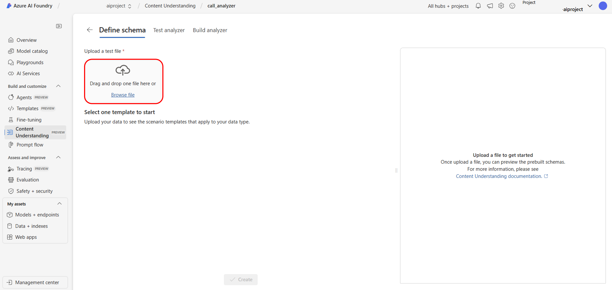
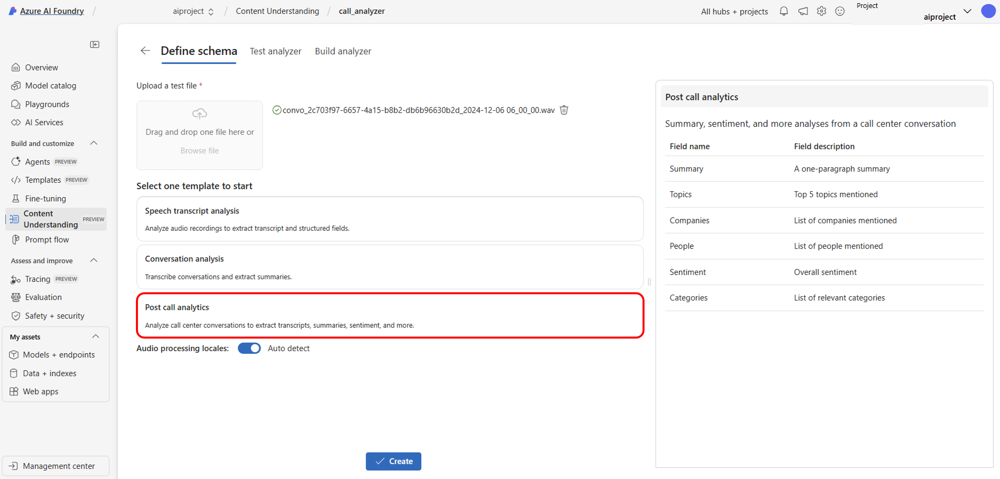
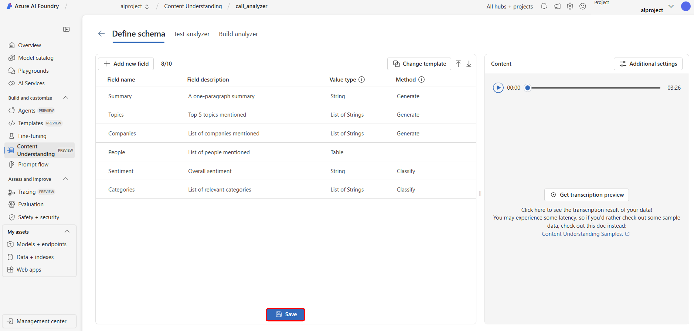
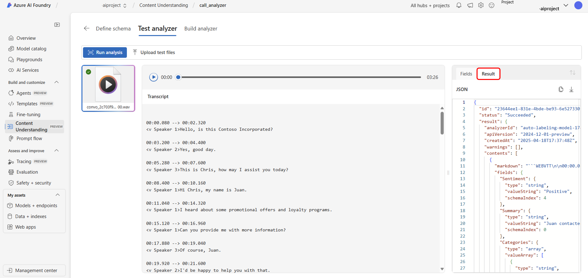

# Create your first Content Understanding project in the AI Foundry

## Step 1: Create a Content Understanding Project

- Navigate to the [AI Foundry homepage](https://ai.azure.com) and select Try Content Understanding.
> **Note**: You will need to create a project in one of the following regions: westus, swedencentral, or australiaeast

     

- Select + Create to create a new Content Understand project.

  

- Provide a name for your project (i.e. call_analyzer), select create a new hub, keep the default Azure AI service connection and select Next
  
- Keep the default storage account, select next and select Create project. 

- Select Browse file to upload the sample audio file included in this [workshop](../data/convo_2c703f97-6657-4a15-b8b2-db6b96630b2d_2024-12-06%2006_00_00.wav).

  

- Select the Post call analytics template and select create. 
  

- Save the default schema 
  

- Select Run analysis and review the fields on the left side  
  

- Select the Results to view the JSON output.
  
 
In this challenge we saw how to process one audio file through Azure AI Foundry. In a later challenge, we will see how to process multiple files for a full AI application and chat with data scenario through a pro-code approach.  

> For more detailed information and advanced configurations, refer to the official [Azure AI Content Understanding documentation](https://learn.microsoft.com/en-us/azure/ai-services/content-understanding/quickstart/use-ai-foundry).

