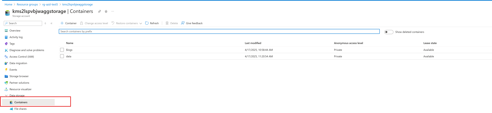

<!-- ## **1. Overview of the Data** -->

To access and explore the ingested data:

1. Go to [Azure Portal](https://portal.azure.com/)

2. Locate the Resource Group where the solution is deployed

3. Click on the Storage Account associated with the solution
      

4. Navigate to Containers section
      

5. Open the container named data

You’ll see two folders:

- audiodata → Contains uploaded call recordings
      

call_transcripts → Stores the transcript text used for AI processing
      
<!-- The Sample dataset used for this solution contains customer interactions categorized into various topics. Each entry includes:

- **ConversationId**: Unique identifier for each conversation.
- **StartTime** and **EndTime**: Timestamps for when the conversation occurred.
- **Content**: Full transcript of the conversation.
- **Summary**: A concise summary of the interaction.
- **Sentiment**: Sentiment analysis of the conversation (e.g., Positive, Negative).
- **Topic**: The main topic of the conversation.
- **Key Phrases**: Extracted key phrases for quick insights.
- **Complaint**: Specific complaints raised by the customer (if any).
- **Mined Topic**: Categorized topic based on the conversation.

--- -->

## **Data Flow**

### **Data Processing**
When you deploy this solution, the [Process Data](https://github.com/microsoft/Conversation-Knowledge-Mining-Solution-Accelerator/blob/main/infra/scripts/index_scripts/03_cu_process_data_text.py) script gathers call transcripts and audio data, which are analyzed using Azure AI Content Understanding to extract essential details such as conversation IDs, call content, summaries, sentiments, and more. This processed data is subsequently stored in an Azure SQL database for ongoing analysis and easy retrieval.
The script also generates text embeddings, which are uploaded to an Azure AI Search index for future retrieval.
Additional details about the processed data : 

### **Text Analysis**
- **Sentiment Analysis**: Determines the overall sentiment of the conversation (Positive or Negative).
- **Topic Mining**: Identifies the main topic of the conversation (e.g., Billing Issues, Device Troubleshooting).
- **Key Phrase Extraction**: Highlights important phrases for quick insights.
- **Complaint Identification**: Extracts specific complaints raised by the customer.

### **Structuring the Data**
- The analyzed data is structured into JSON format for easy querying and visualization.
<!-- - The analyzed data is structured into Azure SQL Database tables for easy querying and visualization.  -->

<!-- ## ** Key Insights**
### **Frequent Topics**
1. **Account Management**:
      - Includes account updates, voicemail setup, and call forwarding.
      - Example: Updating address and email information.

2. **Billing Issues**:
      - Covers billing discrepancies, payment failures, and refunds.
      - Example: Resolving double charges or unexpected fees.

3. **Service Activation**:
      - Assistance with activating new services, SIM cards, or scheduling appointments.
      - Example: Activating a new SIM card or setting up international roaming.

4. **Device Troubleshooting**:
      - Support for device-related issues like freezing, battery drain, or hardware malfunctions.
      - Example: Factory reset for a tablet or troubleshooting a phone's battery.

5. **Internet Connectivity**:
      - Troubleshooting slow or unreliable internet connections.
      - Example: Diagnosing slow speeds and resetting modems.

6. **Parental Controls**:
      - Setting up and managing parental controls for children’s devices.
      - Example: Configuring screen time limits and app restrictions.

### **Sentiment Analysis**
- **Positive Sentiment**: Majority of interactions indicate customer satisfaction with the support provided.
- **Negative Sentiment**: Often linked to unresolved billing issues or technical difficulties. -->

<!-- ### **Common Complaints**
- Billing discrepancies (e.g., double charges, unexpected fees).
- Internet speed issues.
- Device malfunctions (e.g., freezing, battery drain).

--- -->

## **Analyzer Workflow**

### **Sentiment Analysis**
- Uses Natural Language Processing (NLP) to classify the sentiment as Positive or Negative.
- Example: "Thank you for your help" → Positive sentiment.

### **Topic Mining**
- Identifies the main topic of the conversation using keyword matching and clustering.
- Example: Keywords like "billing," "charges," and "refund" → Topic: Billing Issues.

### **Key Phrase Extraction**
- Extracts important phrases using NLP techniques like Named Entity Recognition (NER).
- Example: "slow Internet speed," "paperless billing," "factory reset."

### **Complaint Identification**
- Searches for explicit complaints in the conversation.
- Example: "My bill was $50 higher than usual" → Complaint: Higher bill.