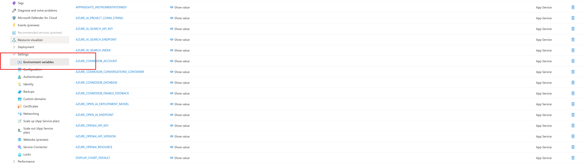

# Workshop Challenge: Changing the Logo in the App

One of the easiest and most fun changes you can make to the app is updating the logo! Follow these step-by-step instructions to replace the current logo with your own or use the provided **ContosoImg** logo.

---

### Step 1: Prepare Your New Logo
1. Create or use a new logo (e.g [Contoso Img logo](../../../../../src/App/src/Assets/ContosoImg.png)) in `src/app/src/Assets/`.
2. Save the logo as an image file (e.g., `logo.png`).
3. Ensure the image has a reasonable size (e.g., 100x100 pixels) for better display.
4. Place the logo file in the following folder:
    `src/app/src/Assets/`

---

### Step 2: Update the Logo Component

1. Open the `App.tsx` file located at:  
   ```
   src/App/src/App.tsx
   ```

2. Comment out the original import on **line 29**:

   ```tsx
   // import { AppLogo } from "./components/Svg/Svg";
   ```

3. Add a new import statement for your logo image:

   ```tsx
   import AppLogo from "./Assets/contosoimg/ContosoImg.png";
   ```

4. Locate the current logo implementation (around line 309):
    
    ``` tsx
   <AppLogo />
   ```


5. Comment out the existing logo component and replace it with the image tag:

   ```tsx
   // <AppLogo />
   
   ```

---

### Step 3: Run the App

1. Go to the [Azure Portal](https://portal.azure.com).
2. In the **search bar**, type the name of the **Resource Group** you created during **Challenge 1**.
3. Within the resource group, look for the **API App Service** ending in -api.  
4. In the App Service, navigate to **Settings > Environment variables**.
   
5. Locate the following environment variables:
   - `AZURE_AI_SEARCH_API_KEY`
6. Copy their values and paste them into your local `\workshop\docs\workshop\.env.sample` file:
   `AZURE_AI_SEARCH_API_KEY=your-key-from-portal`
7. Rename the .env.sample file to .env
8. Open a terminal or command prompt.
9. Navigate to the project directory where `start.cmd` is located:

   ```bash
      cd src/
   ```
10. Make sure your Python virtual environment is activated, as done in the [Challenge 1 deployment](../Challenge-1/Deployment.md) steps.
      * This script will perform the following: 
         * Take the environment variables from the deployment and populate the rest of the varibales in the .env file to run the app locally. 
         * Copy the .env file from the src folder to the workshop folder for the next challenges. 
         * Assign the needed roles for the Azure SQL database and Azure Cosmos DB
         * Run the app locally
11. Start the application:
   
   ```bash
    ./start.cmd
   ```
12. Two terminal windows will open — one for the backend and one for the frontend.

Once the app starts, you should see your new logo!


