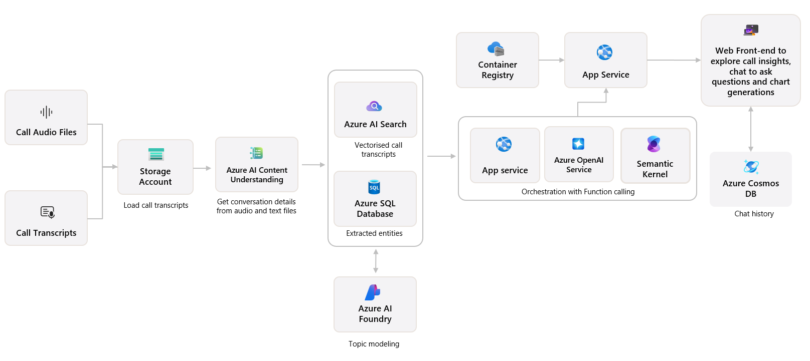

## Technical Architecture

This section outlines the components and interactions that power the conversational insights platform. The architecture ingests call transcripts and audio files, applies AI services for enrichment and structuring, and surfaces insights via an interactive web experience.

### Call Audio Files / Call Transcripts  
Raw audio and text-based transcripts are the primary input into the system. These files are uploaded and stored for downstream processing.

### Storage Account  
Stores uploaded call transcripts and audio files. Serves as the initial staging layer before processing begins.

### Azure AI Content Understanding  
Processes the audio and text files to extract conversation details, including speaker turns, timestamps, and semantic structure.

### Azure AI Search  
Indexes the vectorized transcripts for semantic search. Enables rapid retrieval of relevant conversation snippets and contextual fragments using vector search and keyword matching.

### SQL Database  
Stores structured output including extracted entities, mapped concepts, and additional metadata.

### Azure AI Services  
Performs topic modeling on enriched transcript data, uncovering themes and conversation patterns using pre-trained models.

### Azure OpenAI Service  
Provides large language model (LLM) capabilities to support summarization, natural language querying, and semantic enrichment.

### Semantic Kernel  
Handles orchestration and intelligent function calling for contextualized responses and multi-step reasoning over retrieved data.

### App Service  
Hosts the web application and API layer that interfaces with the AI services and storage layers. Manages user sessions and handles REST calls.

### Container Registry  
Stores containerized deployments for use in the hosting environment.

### Azure Cosmos DB  
Persists chat history and session context for the web interface. Enables retrieval of past interactions.

### Web Front-End  
An interactive UI where users can explore call insights, visualize trends, ask questions in natural language, and generate charts. Connects directly to Cosmos DB and App Services for real-time interaction.